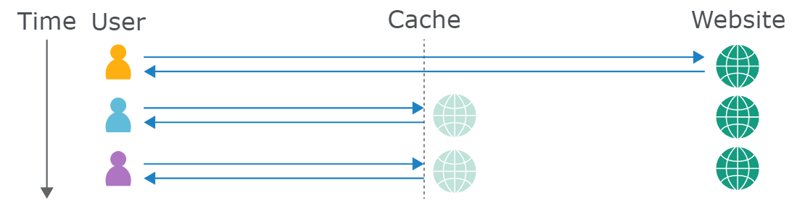

# Web Cache Vulnerabilities
This is about two different type of vulnerabilities that use the web cache as attack surface. The vulnerabilities use the same idea of exploitation, but they have a different goal. These are the topics:
- [Web Cache Deception](#web-cache-deception)
- [Web Cache Poisoning](#web-cache-poisoning)

## Web Caches
A web cache is a system that sits between the origin server and the user. When a client requests a static resource, the request is first directed to the cache. If the cache doesn't contain a copy of the resource (known as a cache miss), the request is forwarded to the origin server, which processes and responds to the request. The response is then sent to the cache before being sent to the user. The cache uses a preconfigured set of rules to determine whether to store the response.

When a request for the same static resource is made in the future, the cache serves the stored copy of the response directly to the user (known as a cache hit). You can see in the response header `X-Cache` whether or not you got a fresh response or not. The [`Cache-Control`](https://developer.mozilla.org/en-US/docs/Web/HTTP/Headers/Cache-Control) header decides/shows the "settings" of the cache kinda.

> Generally only requests that use `GET`, `HEAD` or `OPTIONS` are cachable



### Cache Keys
The cache must decide if there is a cached response that it can serve directly, or if it has to forward the request. The cache does this by generating a `cache key` from elements of the HTTP request. This typically includes the URL path, query parameters, and some important headers. If the cache key is equivalent, it serves the cached response.

When testing for web cache vulnerabilities, you generally don't want to receive cached responses. That is why you should use a dynamic cachebuster. This is already implemented in the [Param Miner Extension](../burp/param_miner.md#dynamic-cachebuster). This makes your life way easier.

### Cache Rules
Cache rules determine what can be cached and for how long. These are some type of rules that can be enforced:
- Static file extension rules: Cache `.css`, `.exe` or `.js` for example.
- Static directory rules: Match URL against a prefix, for example `/static` or `/assests`.
- File name rules: Cache specific files that are universally required for web, such as `robots.txt` and `favicon.ico`.


# Web Cache Deception
Web cache deception exploits cache rules to trick the cache into storing sensitive or private content, which the attacker can then access.

## Exploiting Cache Rules

### Path Mapping
Difference between traditional and RESTful path mappings. Cache might see it as a path to a static file and cache it, while the server might just ignore the last part and retrieves the user profile.
```url
http://example.com/user/123/profile/wcd.css
```

### Delimiters
Generally, `?` is used to separate URL path from the query string. This one is probably not usable for exploits, but here are some that might be useful:

- In Java Spring `;` is used to add matrix variables, so it truncates the path.
- Ruby on Rails uses `.` as a delimiter to specify the response format. So `.ico`, which isn't recognized by Ruby on Rails, will be handled by the default HTML formatter. And maybe the cache stores `.ico` requests.
- OpenLiteSpeed server uses `%00` as a delimiter, and if the cache uses Akamai or Fastly, they would iterpret everything as path.

Here are some more delimiters that might prove helpful, provided by Portswigger: [delimiter list](https://portswigger.net/web-security/web-cache-deception/wcd-lab-delimiter-list).

Sometimes there are also some discrepancies in the handling of encoded delimiters. That is why you should also try the encoded version of these delimiters, included non-printable ones like `%00`, `%0A`, `%0D` and `%09` (or just all of them lmao).

### Path Normalization
When the cache always caches files in the directories like `/static`, you can try [path traversal attacks](./path_traversal.md). This might allow you to cache files that aren't in the static directory.

You can also try it in reverse with static files like `/index.html` using a payload like `/profile%2f%2e%2e%2findex.html`.


# Web Cache Poisoning
Web cache poisoning manipulates cache keys to inject malicious content into a cached response, which is then served to other users.
